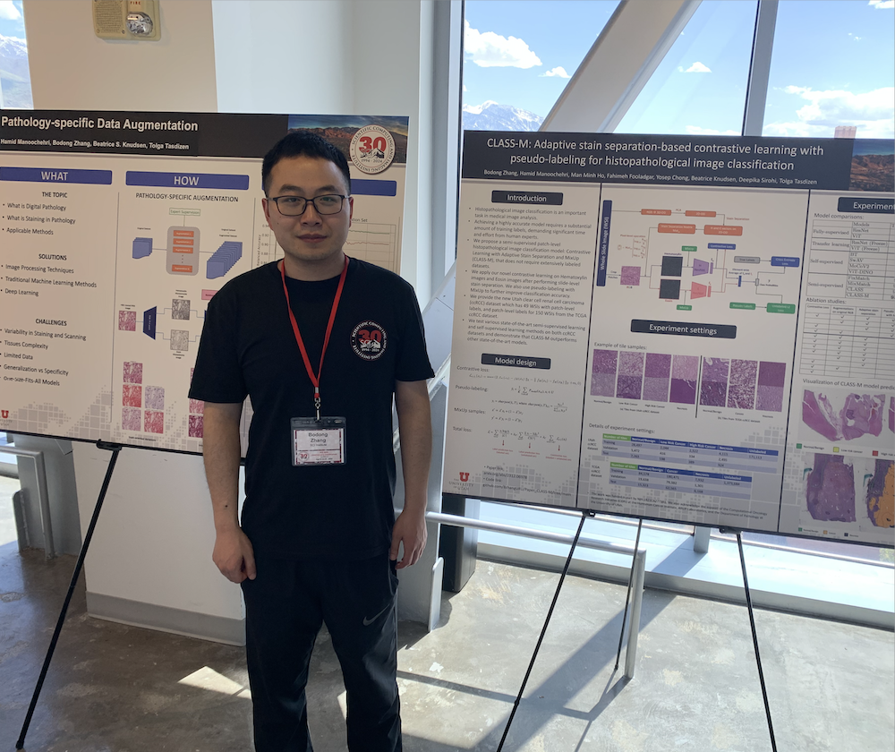

     <!-- Adds three empty lines -->
# Bodong Zhang (张博栋)

<!-- Profile photo here -->

  

PhD Student at the Department of Electrical and Computer Engineering,

Research Assistant at Scientific Computing and Imaging Institute,

University of Utah, Salt Lake City, UT, USA

<!-- [Link to another page](./another-page.html) -->
<!-- [Linkedin](https://www.linkedin.com/in/bodongzhang) -->

    <a href="https://www.linkedin.com/in/bodongzhang" style="color: #007bff; text-decoration: none;">Linkedin</a>

    <a href="https://github.com/BzhangURU" style="color: #007bff; text-decoration: none;">Github</a>

Email: bodong.zhang at utah.edu / bodong.zhang at yahoo.com

<!-- There should be whitespace between paragraphs. We recommend including a README, or a file with information about your project. -->
 

# About Me

I am currently a fourth year PhD student at the Department of Electrical and Computer Engineering, University of Utah, and I am expected to graduate in Dec, 2025. I also work as a research assistant at Scientific Computing and Imaging Institute, University of Utah during my whole PhD. My advisor is Tolga Tasdizen. 

Before PhD, I received my Bachelor's degree in Electronic Information Engineering at University of Science and Technology of China in Jul, 2014, where I was also enrolled in the Talent Program in Computer and Information Science and Technology. I received my Master's degree at the Department of Electrical and Computer Engineering, University of Utah in Dec, 2016. 

# Research Interests

Computer Vision, Deep Learning, Machine Learning, Image Processing. 

# Programming
During my PhD, I mainly use Python, PyTorch, OpenCV in Linux OS as research tools. In the past, I also had experience of C/C++, Java, Matlab and Tensorflow.  
 

# Work Experience
### Research Assistant, Scientific Computing & Imaging Institute, University of Utah, Salt Lake City, UT, USA

Aug 2021 – present  

I am collaborating with medical group to apply computer vision and deep learning techniques on medical images. The research topics are highly related to contrastive learning, image augmentation, self-supervised learning, semi-supervised learning and multiple instance learning.  

### Image Processing Software Engineer, Code Corporation, Greater Boston Area, MA, USA

Aug 2017 – Jul 2021  

1.  Finished image classification project independently for three types of company’s barcode reader products.
2.  Improved PDF417 and DPM 2D barcode decoding performance.
3.  Designed and implemented DotCode 2D barcode decoding algorithms for European customers from scratch.

### Image Processing Software Intern, Code Corporation, Greater Boston Area, MA, USA

Apr 2017 – Aug 2017  

1.  Wrote image classification programs in C independently under strict restrictions of processing time and buffer size.
2.  Reduced classification processing time from 20 ms to 0.4 ms and also increased accuracy from 85% to 94%.
3.  Developed method to reduce JPEG decompression time from 95 ms to 78 ms on barcode reader device.

### Research Volunteer, University of Utah, Salt Lake City, UT, USA

Feb 2017 – Jun 2017  

1.  Designed method and wrote code for image segmentation and detecting skeleton of chromosomes.
2.  Discussion and presentation of basic deep learning algorithms.

### Research Assistant, Rensselaer Polytechnic Institute, Troy, NY, USA

Aug 2014 – Dec 2014  

1.  Wrote code for facial feature detection in videos and tested accuracy.
2.  Implemented codes for eye detection, thermal feature detection, blink detection and pose estimation.

### Student Researcher, Image Processing Lab, University of Science and Technology of China, Hefei, Anhui Province, China

Mar 2013 – Jun 2014  

1.  Did research on image completion to fill extremely large missing holes in images automatically.
2.  Independently built image completion software with user interface.

 

# Publications

*: equal contributions

### SRA: A Novel Method to Improve Feature Embedding in Self-supervised Learning for Histopathological Images

Hamid Manoochehri*, <strong>Bodong Zhang</strong>*, Beatrice Knudsen, Tolga Tasdizen

In submission

    <a href="https://arxiv.org/abs/2410.17514" style="color: #007bff; text-decoration: none;">paper</a>&nbsp;&nbsp;&nbsp;&nbsp;&nbsp;
    <a href="https://github.com/hamidmanoochehri/Paper_PathMoCo" style="color: #007bff; text-decoration: none;">code</a>

### DuoFormer: Leveraging Hierarchical Visual Representations by Local and Global Attention

Xiaoya Tang, <strong>Bodong Zhang</strong>, Beatrice S Knudsen, Tolga Tasdizen

In submission

    <a href="https://arxiv.org/abs/2407.13920" style="color: #007bff; text-decoration: none;">paper</a>

### CLASS-M: Adaptive Stain Separation-based Contrastive Learning with Pseudo-Labeling for Histopathological Image Classification

<strong>Bodong Zhang</strong>, Hamid Manoochehri, Man Minh Ho, Fahimeh Fooladgar, Yosep Chong, Beatrice Knudsen, Deepika Sirohi, Tolga Tasdizen

Submitted to the Journal of Medical Image Analysis, in major revision process

    <a href="https://arxiv.org/abs/2312.06978" style="color: #007bff; text-decoration: none;">paper</a>&nbsp;&nbsp;&nbsp;&nbsp;&nbsp;  
    <a href="https://github.com/BzhangURU/Paper_CLASS-M/tree/main" style="color: #007bff; text-decoration: none;">code</a>

### MP41-13 Quantitative Assessment of Mesenchymal Differentiation for Metastatic Risk Prediction of Clear Cell Renal Carcinoma (ccRCC)

Daniel Vilchez, <strong>Bodong Zhang</strong>, Alejandro Sanchez, Deepika Sirohi, Tolga Tasdizen, Beatrice Knudsen

The Journal of Urology 209 (Supplement 4), e560

    <a href="https://www.auajournals.org/doi/10.1097/JU.0000000000003279.13" style="color: #007bff; text-decoration: none;">paper</a>

### Stain Based Contrastive Co-training for Histopathological Image Analysis

<strong>Bodong Zhang</strong>, Beatrice Knudsen, Deepika Sirohi, Alessandro Ferrero, Tolga Tasdizen

MICCAI 2022 Workshop on Medical Image Learning with Limited and Noisy Data

    <a href="https://arxiv.org/abs/2206.12505" style="color: #007bff; text-decoration: none;">paper</a>&nbsp;&nbsp;&nbsp;&nbsp;&nbsp;  
    <a href="https://github.com/BzhangURU/Paper_2022_Co-training" style="color: #007bff; text-decoration: none;">code</a>

 

# Projects
### Machine Learning, fall 2016: Box Office Prediction & IMDB Rating Analysis

Use a combination of machine learning algorithms to predict box office and IMDB rating of movies. 

    <a href="https://github.com/BzhangURU/Machine-Learning-Project/blob/master/final_project/ML_final_project_report.pdf" style="color: #007bff; text-decoration: none;">PDF_report</a>

More machine learning projects can be found
    <a href="https://github.com/BzhangURU/Machine-Learning-Project" style="color: #007bff; text-decoration: none;">here</a>

### Estimation Theory, spring 2016: Object Tracking Using Kalman Filter

Object tracking with challenges of occlusion and alteration in size of the object. 

    <a href="https://github.com/BzhangURU/Object-Tracking-in-Videos/blob/master/Bodong%2CSayali%2CSoroosh%20-%20ECE%206540%20(Estimation%20Theory)%20%20Project%20Report.pdf" style="color: #007bff; text-decoration: none;">PDF_report</a>  &nbsp;&nbsp;&nbsp;&nbsp;&nbsp;  
    <a href="https://github.com/BzhangURU/Object-Tracking-in-Videos/blob/master/Poster_Bodong_Sayali_Soroosh.pdf" style="color: #007bff; text-decoration: none;">Poster</a>     &nbsp;&nbsp;&nbsp;&nbsp;&nbsp;  
    <a href="https://github.com/BzhangURU/Object-Tracking-in-Videos/tree/master/video%20demonstration" style="color: #007bff; text-decoration: none;">Video_demonstration</a>   

### Digital Image Processing, fall 2015

Related projects (e.g., image filtering and image segmentation) can be found
    <a href="https://github.com/BzhangURU/Digital-Image-Processing-Project" style="color: #007bff; text-decoration: none;">here</a>

### 3D Computer Vision, spring 2015: Estimation of Single Camera Location

Propose my own method to estimate camera location by taking a photo of special landmark in any direction and location. 

    <a href="https://github.com/BzhangURU/3D-Computer-Vision-Project/blob/master/Final_Project/Final_Project_Report_Bodong_Zhang.pdf" style="color: #007bff; text-decoration: none;">PDF_report</a>  &nbsp;&nbsp;&nbsp;&nbsp;&nbsp;  
    <a href="https://github.com/BzhangURU/3D-Computer-Vision-Project/blob/master/Final_Project/Presentation_Final_project_Bodong%20Zhang.pdf" style="color: #007bff; text-decoration: none;">Presentation_slides</a>     &nbsp;&nbsp;&nbsp;&nbsp;&nbsp;  
    <a href="https://github.com/BzhangURU/3D-Computer-Vision-Project/tree/master/Final_Project" style="color: #007bff; text-decoration: none;">Matlab_code</a>   

### Undergraduate Thesis, summer 2014: Exemplar-Based Image Completion 

Proposed and implemented image completion algorithms to fill extremely large missing holes in images automatically. Related papers, presentations, thesis and C++/OpenCV/QT code can be found 
    <a href="https://github.com/BzhangURU/Image-Completion-Research" style="color: #007bff; text-decoration: none;">here</a>

 

# Languages

English (Professional), Chinese (Native speaker)

TOEFL test: 101/120 (taken in Nov, 2013)

 
 
 
<!-- 
 -->

    

